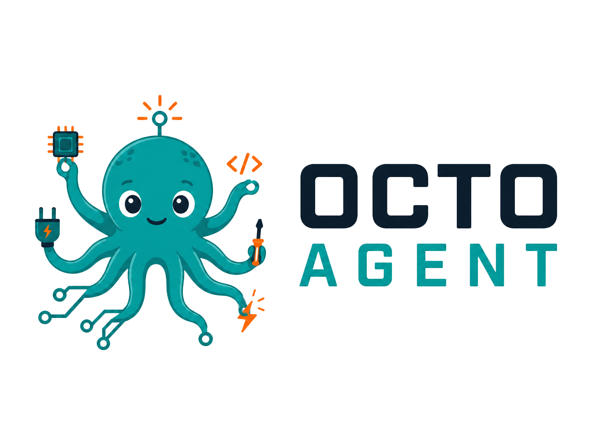

  

# Octo Agent

> **Octo Agent is an independent, community fork of the [Arduino IDE](https://github.com/arduino/arduino-ide).** It is **not affiliated with, sponsored by, or endorsed by Arduino s.r.l.** "Arduino" is a trademark of Arduino s.r.l., used here only to describe the upstream project this fork is derived from. Octo Agent adds an integrated agentic development workflow (Claude Code) on top of the upstream IDE.

This repository is a fork of the Arduino IDE 2.x source. If you're looking for the official, Arduino-maintained IDE, go to the [upstream repository](https://github.com/arduino/arduino-ide).

Like its upstream, the Arduino IDE 2.x is a major rewrite, sharing no code with the IDE 1.x. It is based on the [Theia IDE](https://theia-ide.org/) framework and built with [Electron](https://www.electronjs.org/). The backend operations such as compilation and uploading are offloaded to an [arduino-cli](https://github.com/arduino/arduino-cli) instance running in daemon mode. This new IDE was developed with the goal of preserving the same interface and user experience of the previous major version in order to provide a frictionless upgrade.

## Download

You can download the latest release version and nightly builds from the [software download page on the Arduino website](https://www.arduino.cc/en/software).

## Support

If you need assistance, see the [Help Center](https://support.arduino.cc/hc/en-us/categories/360002212660-Software-and-Downloads) and browse the [forum](https://forum.arduino.cc/index.php?board=150.0).

## Bugs & Issues

If you want to report an issue, you can submit it to the [issue tracker](https://github.com/arduino/arduino-ide/issues) of this repository.

See [**the issue report guide**](docs/contributor-guide/issues.md#issue-report-guide) for instructions.

### Security

If you think you found a vulnerability or other security-related bug in this project, please read our
[security policy](https://github.com/arduino/arduino-ide/security/policy) and report the bug to our Security Team 🛡️
Thank you!

e-mail contact: security@arduino.cc

## Contributions and development

Contributions are very welcome! There are several ways to participate in this project, including:

- Fixing bugs
- Beta testing
- Translation

See [**the contributor guide**](docs/CONTRIBUTING.md#contributor-guide) for more information.

See the [**development guide**](docs/development.md) for a technical overview of the application and instructions for building the code.

### Support the project

This open source code was written by the Arduino team and is maintained on a daily basis with the help of the community. We invest a considerable amount of time in development, testing and optimization. Please consider [buying original Arduino boards](https://store.arduino.cc/) to support our work on the project.

## License

The code contained in this repository and the executable distributions are licensed under the terms of the GNU AGPLv3. The executable distributions contain third-party code licensed under other compatible licenses such as GPLv2, MIT and BSD-3.

Octo Agent is a derivative work of the Arduino IDE and remains licensed under the GNU AGPLv3, as required. The original copyright remains with Arduino s.r.l. and/or its affiliated companies; this fork's modifications are likewise released under the AGPLv3. For licensing questions about the upstream Arduino IDE, contact Arduino at [license@arduino.cc](mailto:license@arduino.cc). The Octo Agent name and logo are not covered by the AGPL and are not Arduino trademarks.
